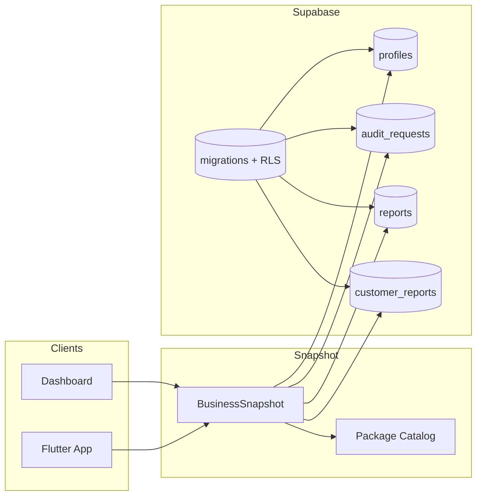

# Architecture

Status: Production

Last updated: 2026-07-13

## Current Implementation

The repository ships a paid-pilot portal stack composed of:

- `dashboard/`: Next.js 15 customer/admin portal
- `mobile/`: Flutter companion app
- `supabase/`: Postgres schema, RLS, triggers, helper functions, and seed/bootstrap migrations
- `shared/`: shared package catalog used by the dashboard and call-sheet content
- `shared/growthOsModel.ts`: lifecycle stages, workflow templates, and operational queue definitions for the future Growth OS

`BusinessSnapshot` is the canonical app-level contract that reconciles profile, audit request, report, and assignment data for both clients.

### Layers

- Presentation layer: Next.js App Router pages and Flutter screens
- Snapshot layer: `dashboard/lib/businessSnapshot.ts` and `mobile/lib/models/business_snapshot.dart`
- Persistence layer: Supabase tables and policies
- Operational scaffold: `dashboard/lib/orchestrator.ts`
- Reference content: internal call sheet and docs
- Growth OS model layer: `shared/growthOsModel.ts`

### Component View

## Production

- Authenticated dashboard routes, account pages, report views, signup, login, and request-audit flow exist.
- The mobile app supports login, dashboard, audit request, and report views.
- Package access is canonicalized through `core`, `elite`, and `agent_workflow_24_7`.
- Supabase migrations define the active V1 schema and compatibility rules.

## MVP

- Manual package assignment in Supabase.
- Assigned report viewing through the snapshot model.
- Audit request intake through web and mobile.
- Internal call-sheet guidance for operators.

## In Progress

- `dashboard/lib/orchestrator.ts` is only a skeleton.
- The repository documents a future AI/operations runtime, but no live autonomous executor ships yet.
- The knowledge base is being centralized here as permanent project memory.

## Roadmap

- Event-driven Growth OS runtime.
- Agent Factory and multi-tenant agent provisioning.
- Revenue intelligence and business-intelligence modules.
- Operational dashboards for fulfillment and automation.

## Dependencies

- Next.js, React, TypeScript, and Lucide on the dashboard
- Flutter, `flutter_dotenv`, and `supabase_flutter` on mobile
- Supabase Auth, Postgres, triggers, and RLS in the backend
- Shared package catalog in `shared/packageCatalog.ts`
- Shared Growth OS lifecycle/workflow model in `shared/growthOsModel.ts`

## Known Limitations

- No live agent execution runtime exists yet.
- No customer-facing self-service checkout exists yet.
- Mobile and dashboard still rely on manual package assignment.
- The tenancy model is still user-centric; workspace membership and agent isolation will require a dedicated workspace model before full AGOS provisioning can be live.
- Flutter test execution is host-dependent in this sandbox.
