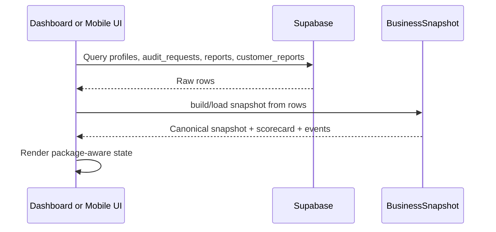

# BusinessSnapshot

Status: Production

Last updated: 2026-07-13

## Summary

`BusinessSnapshot` is the canonical contract for business state.
It reconciles the raw Supabase rows into one structure that the dashboard and mobile app can read consistently.

Source implementations:

- `dashboard/lib/businessSnapshot.ts`
- `mobile/lib/models/business_snapshot.dart`
- `shared/packageCatalog.ts`

## Current Data Model

The snapshot is built from:

- `profiles`
- `audit_requests`
- `reports`
- `customer_reports`

It exposes:

- profile metadata
- audit-request history
- catalog reports
- assigned reports
- visible reports
- summary labels
- provenance
- events
- scorecard

## Interfaces

- `loadBusinessSnapshot()` loads and reconciles rows from Supabase.
- `buildBusinessSnapshot()` converts raw rows into a typed snapshot.
- `buildBusinessSnapshotScorecard()` derives the current summary score.
- `buildBusinessSnapshotEvents()` emits audit events for the snapshot lifecycle.

## Canonical Rules

- The dashboard and mobile app must not re-implement package access or report visibility in each screen.
- Package normalization happens centrally through the shared catalog.
- Report access is derived from the reconciled package hierarchy, not hardcoded screen logic.
- Legacy aliases remain read-compatible only.

## Sequence

## Production

- Snapshot loading exists in both clients.
- Package aliases are normalized.
- Assigned reports are resolved through `customer_reports`.
- The snapshot includes provenance and scorecard data.

## MVP

- Customer profile reconciliation.
- Audit request ordering and summary labels.
- Package-aware report visibility.

## In Progress

- The snapshot is still a read-model only.
- No write-side event store is live yet.
- No asynchronous projection pipeline is wired.

## Roadmap

- Persisted business snapshot history.
- Event publication from actual business actions.
- Snapshot-backed intelligence services.

## Dependencies

- Supabase rows and RLS policies
- Shared canonical package catalog
- Dashboard and mobile client models

## Known Limitations

- The snapshot is only as complete as the rows the user is allowed to read.
- No direct customer billing state is part of the current snapshot.
- No live operational workflow engine writes back into the snapshot yet.
