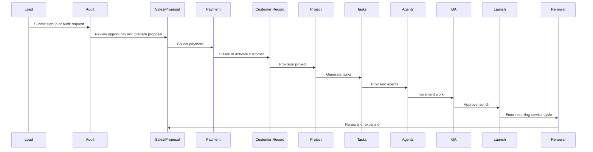

# Customer Lifecycle

Status: Production

Last updated: 2026-07-13

## Lifecycle

Lead -> Audit -> Proposal -> Payment -> Customer Creation -> Project Creation -> Task Generation -> Agent Provisioning -> Implementation -> QA -> Launch -> Recurring Services -> Renewal

## Current Implementation

The repository currently implements the early and mid lifecycle steps:

- lead capture via signup and landing pages
- audit request submission
- manual package assignment
- customer portal creation
- report assignment and delivery
- internal guidance for downstream operations

The later lifecycle steps are documented here but are not live automations yet.

## Sequence Diagram

## Production

- Lead capture and portal signup exist.
- Audit request intake exists.
- Customer records are represented in Supabase.
- Reports can be assigned after setup.

## MVP

- Manual sales handoff.
- Manual package assignment.
- Manual report delivery.

## In Progress

- Proposal automation.
- Payment-triggered provisioning.
- Task and agent orchestration.

## Roadmap

- Automated implementation pipelines.
- Ongoing recurring services and renewal intelligence.

## Dependencies

- Supabase Auth and profile rows
- audit request and report tables
- package model and BusinessSnapshot

## Known Limitations

- No live payment automation.
- No project provisioning service.
- No task queue or agent executor.
