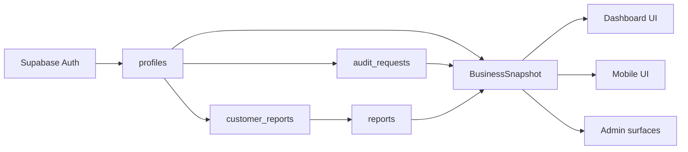

# Data Flow

Status: Production

Last updated: 2026-07-13

## End-To-End Flow

1. A user authenticates through Supabase Auth.
2. The dashboard or mobile app reads the active profile row.
3. The client loads audit requests, reports, and customer report assignments.
4. The snapshot layer canonicalizes package values and visibility rules.
5. The UI renders customer-facing state from `BusinessSnapshot`.
6. Admin workflows update rows in Supabase.
7. The next snapshot load reflects the new state.

## Diagram

## Current Implementation

- Dashboard data loading happens in `dashboard/lib/businessSnapshot.ts`.
- Mobile data loading happens in `mobile/lib/models/business_snapshot.dart`.
- Report visibility is derived from package rank and assignment state.
- Internal operator guidance exists in the dashboard call sheet.

## Interfaces

- Supabase row reads
- snapshot builders
- client rendering
- manual admin updates

## Production

- Snapshot-driven reads.
- Authenticated customer views.
- Manual ops edits.

## MVP

- Customer signup and login.
- Audit request submission.
- Assigned report viewing.

## In Progress

- Live event bus.
- Async workflow processing.
- automated downstream task generation.

## Roadmap

- Task engine.
- Agent orchestration.
- business-intelligence projections.

## Known Limitations

- No push-based sync exists.
- No server-side workflow runtime exists.
- The current model is read-optimized, not event-sourced.
