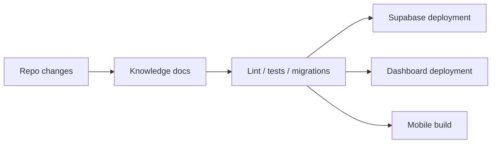

# Deployment

Status: Production

Last updated: 2026-07-13

## Current Runtime

- Dashboard: Next.js app in `dashboard/`
- Mobile: Flutter app in `mobile/`
- Data: Supabase Postgres with migrations and RLS

## Environment Variables

### Dashboard

- `NEXT_PUBLIC_SUPABASE_URL`
- `NEXT_PUBLIC_SUPABASE_ANON_KEY`

### Mobile

- `SUPABASE_URL`
- `SUPABASE_ANON_KEY`

## Release Flow

1. Update code.
2. Update knowledge docs.
3. Run repo checks.
4. Apply Supabase migrations.
5. Deploy dashboard.
6. Ship mobile build if needed.

## Verification

- Dashboard lint and tests
- Mobile tests where the host allows them
- Supabase migration compatibility
- Manual review of auth and report access

## Diagram

## Production

- Dashboard deployment is supported on any Next.js-compatible host.
- Supabase migration files are versioned in the repo.
- Flutter app can be built for mobile distribution.

## MVP

- Manual deployment and migration steps.
- Environment-based auth wiring.

## In Progress

- Better release automation.
- Stronger environment validation.

## Roadmap

- Fully automated deployment pipeline.
- Release observability for payment and workflow systems.

## Known Limitations

- No one-command end-to-end deploy pipeline is shipped.
- Flutter tests can fail in sandboxed environments that block local server sockets.
