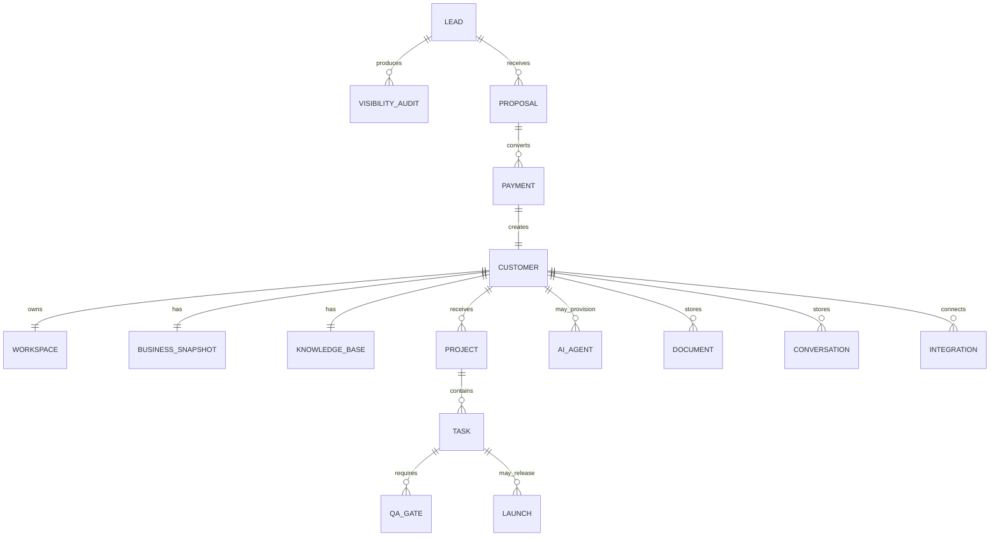

# Domain Model

Status: In Progress

Last updated: 2026-07-13

## Purpose

This document defines the permanent business domain for the portal-to-operations transition.

It separates the currently shipped V1 entities from the future Growth OS objects that will govern post-sale delivery.

## Current Production Model

The current implementation centers on:

- `profiles`
- `audit_requests`
- `reports`
- `customer_reports`
- `business_snapshots`
- `domain_events`

These entities power the current customer portal and the canonical `BusinessSnapshot` read model.

## Growth OS Domain

The Growth OS introduces these domain concepts:

- Lead
- Visibility Audit
- Proposal
- Payment
- Customer Provisioning
- Customer Workspace
- Project
- Task
- AI Agent
- Knowledge Base
- Document
- Conversation
- Integration
- QA Gate
- Launch
- Monthly Service
- Renewal

The code model is defined in:

- [`shared/growthOsModel.ts`](../shared/growthOsModel.ts)
- [`dashboard/lib/growthOsModel.ts`](../dashboard/lib/growthOsModel.ts)

## Relationships

## Production

- The portal already stores profiles, audits, reports, and assignments.
- `BusinessSnapshot` is the current domain contract for client-visible state.
- Package canonicalization is live and shared.

## MVP

- Customer and profile creation.
- Audit request capture.
- Manual package assignment.
- Report assignment and visibility.

## In Progress

- The domain model now has explicit lifecycle stages and workflow templates in code.
- Customer provisioning, project creation, and task expansion are modeled but not yet executed automatically.
- The knowledge base is being centralized as a durable domain concept.

## Roadmap

- Payment-triggered provisioning.
- Workspace creation and agent provisioning.
- Durable tasks, QA gates, and launch records.
- Recurring service and renewal entities.

## Dependencies

- Supabase Auth and RLS
- `BusinessSnapshot`
- shared package catalog
- Growth OS lifecycle model

## Known Limitations

- No separate workspace service exists yet.
- No persistent task engine exists yet.
- No durable customer knowledge store is live yet.

