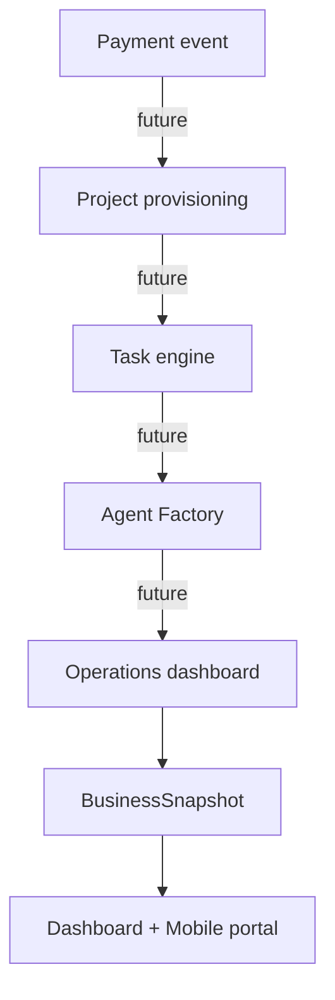

# Operations

Status: In Progress

Last updated: 2026-07-13

## Current Implementation

Operational work is still mostly manual and document-driven.
The repo currently supports:

- payment-adjacent package assignment guidance
- project and account setup via Supabase rows
- audit-request intake
- report assignment and visibility
- internal operator call-sheet guidance
- workflow templates and lifecycle state modeling in shared code

## Operational Modules

### Payment Webhooks

- Not live yet.
- Future payment events should create or update customer state, package access, and downstream work queues.

### Project Provisioning

- Not live yet.
- Today, project creation is represented by manual data setup and documented operator steps.

### Task Engine

- Not live yet.
- The current repo only sketches the future orchestration flow.
- The workflow templates exist in code, but there is no scheduler or queue runner yet.

### Operations Dashboard

- Partial only.
- Admin screens exist, but they are guidance surfaces rather than a full operations console.

### Agent Factory

- Roadmap only.
- No executable factory or provisioning pipeline is shipped.
- The security boundary is still user-centric and will need a dedicated workspace membership model before AGOS-scale agent provisioning is safe.

### BusinessSnapshot

- Live read model.
- It is the current operational join point for dashboard and mobile UX.

### Customer Workspaces

- Customer-facing portal and mobile views exist.
- Workspace isolation is represented through auth and RLS, not through a separate workspace service.

### Knowledge Storage

- This `knowledge/` directory is the canonical documentation store.
- It replaces ad hoc prompt memory as the primary source of architectural truth.

### Portal Synchronization

- The dashboard and mobile app both read the same canonical package and snapshot model.
- Synchronization is read-driven; there is no live orchestration bus yet.

## Sequence

## Production

- Manual ops guidance.
- Supabase-backed data model.
- Admin-entry routes and call sheet.

## MVP

- Manual package assignment.
- Manual report assignment.
- Manual audit triage.

## In Progress

- Centralized operational documentation.
- Canonical snapshot-driven operator workflow.

## Roadmap

- Payment webhook automation.
- Provisioning and task orchestration.
- Workflow audit trails.
- Multi-tenant operations console.

## Known Limitations

- No payment processor integration is shipped.
- No real project provisioning service is shipped.
- No live task engine is shipped.
