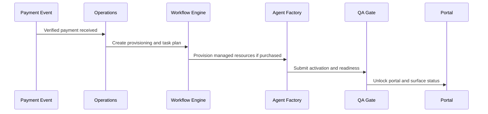

# Workflows

Status: In Progress

Last updated: 2026-07-13

## Purpose

This document defines how the Growth OS should operate after a package is sold.

It captures the current manual process, the modeled workflow templates, and the future automation path.

## Current Implementation

The current repository ships:

- signup and audit request intake
- canonical package normalization
- BusinessSnapshot reconciliation
- manual package assignment guidance
- a non-executing orchestrator skeleton

The workflow model is defined in:

- [`shared/growthOsModel.ts`](../shared/growthOsModel.ts)
- [`dashboard/lib/orchestrator.ts`](../dashboard/lib/orchestrator.ts)
- [`dashboard/lib/workflowArtifacts.ts`](../dashboard/lib/workflowArtifacts.ts)

## Lifecycle Flow

## Workflow Tiers

### Core

- Activate customer workspace
- Create implementation project
- Seed `BusinessSnapshot`
- Generate core workflow tasks

### Elite

- Includes Core
- Add Elite-specific tasks
- Prepare performance reports

### 24/7 Agent Workflow

- Includes Elite
- Provision managed agents
- Initialize agent memory
- Install workflow library
- Configure integrations
- QA and launch

## Current Execution Boundary

- These workflows are templates and control-plane models.
- They do not yet execute automatically on payment events.
- No customer download of agents is supported.

## Operations Workflow

## Production

- Manual workflow guidance exists.
- Customer-facing portal and mobile views already expose the live read model.

## MVP

- Human-controlled task creation and manual package assignment.
- Audit request intake and report delivery.

## In Progress

- Workflow templates for Core, Elite, and 24/7 packages.
- Explicit lifecycle state modeling in code.

## Roadmap

- Stripe or provider-driven webhook onboarding.
- Project automation and task orchestration.
- Agent provisioning and renewal loops.

## Dependencies

- Growth OS lifecycle model
- package catalog
- `BusinessSnapshot`
- future webhook and operations services

## Known Limitations

- No live webhook handler yet.
- No queue or scheduler yet.
- No automatic customer workspace service yet.

